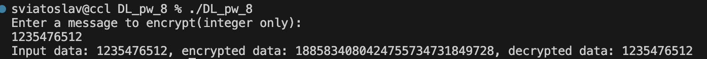

# DL_pw_8
Go implementation of RSA algorithm


## Requirements 

```bash
* go ^1.19
```

## Installation 

1. Clone repository
```bash
git clone https://github.com/Ozu-bezariusu/DL_pw_8.git
```
```bash
cd DL_pw_8
```

2. Build and Run project
```bash
go build
```
```bash
./DL_pw_7 
Enter message to encrypt(int only)
```



## Usage 

```bash
import (
	rsa "DL_pw_8/rsa"
    "math/big"
)

message := big.NewInt(...)
publicKey, privateKye := rsa.KeyGen()

encrypted_message := rsa.Encrypt(message, &publicKey)
decrypted := rsa.Decrypt(encrypted_message, &privateKye)
```
